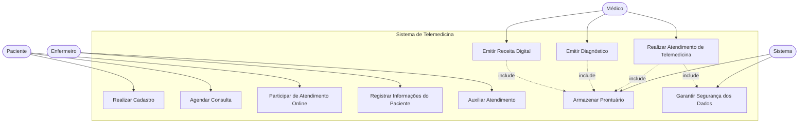
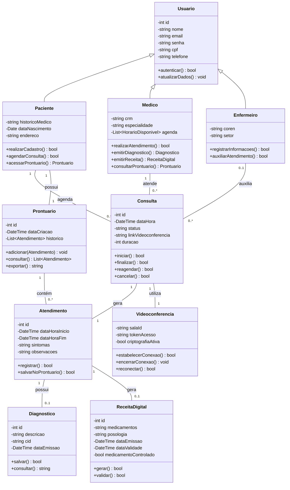
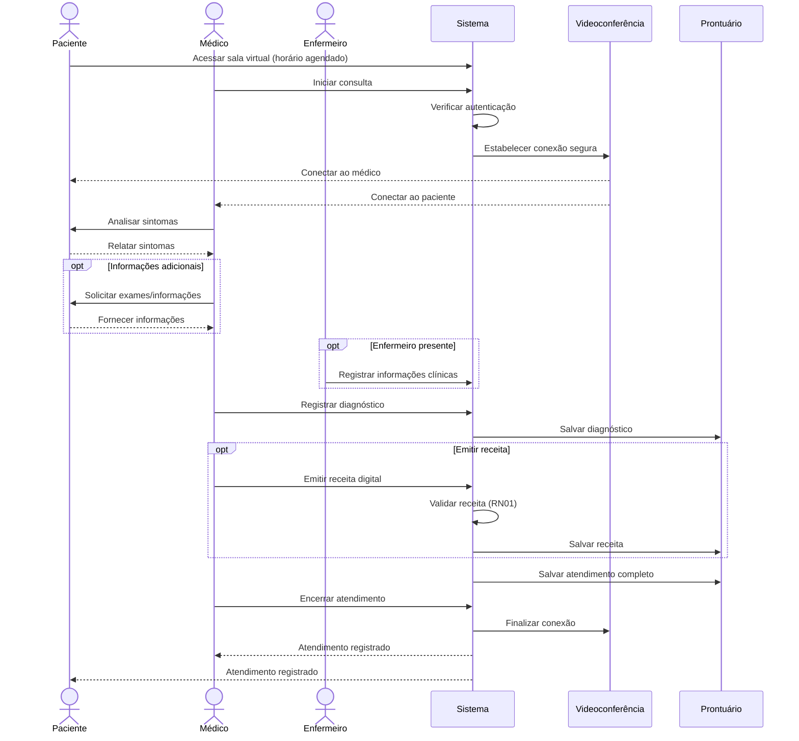
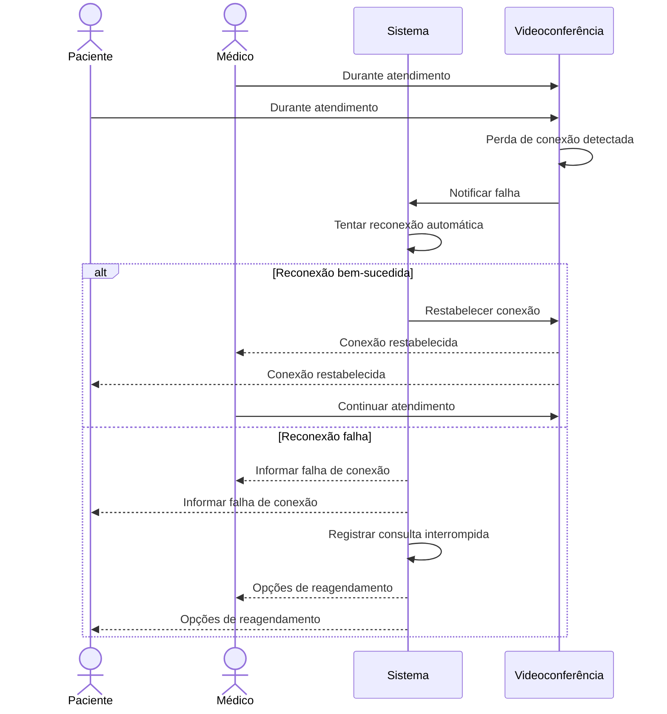
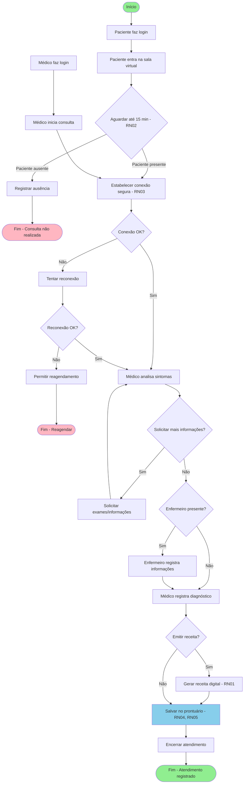
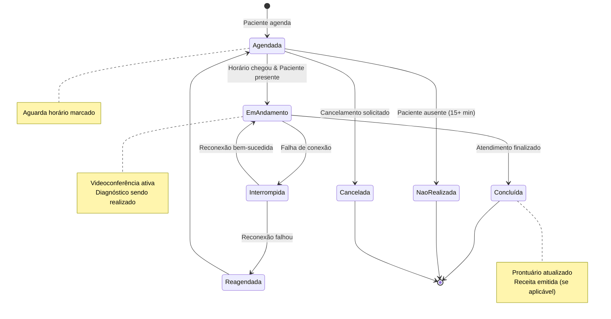
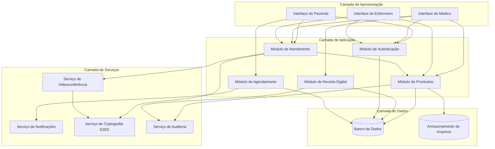
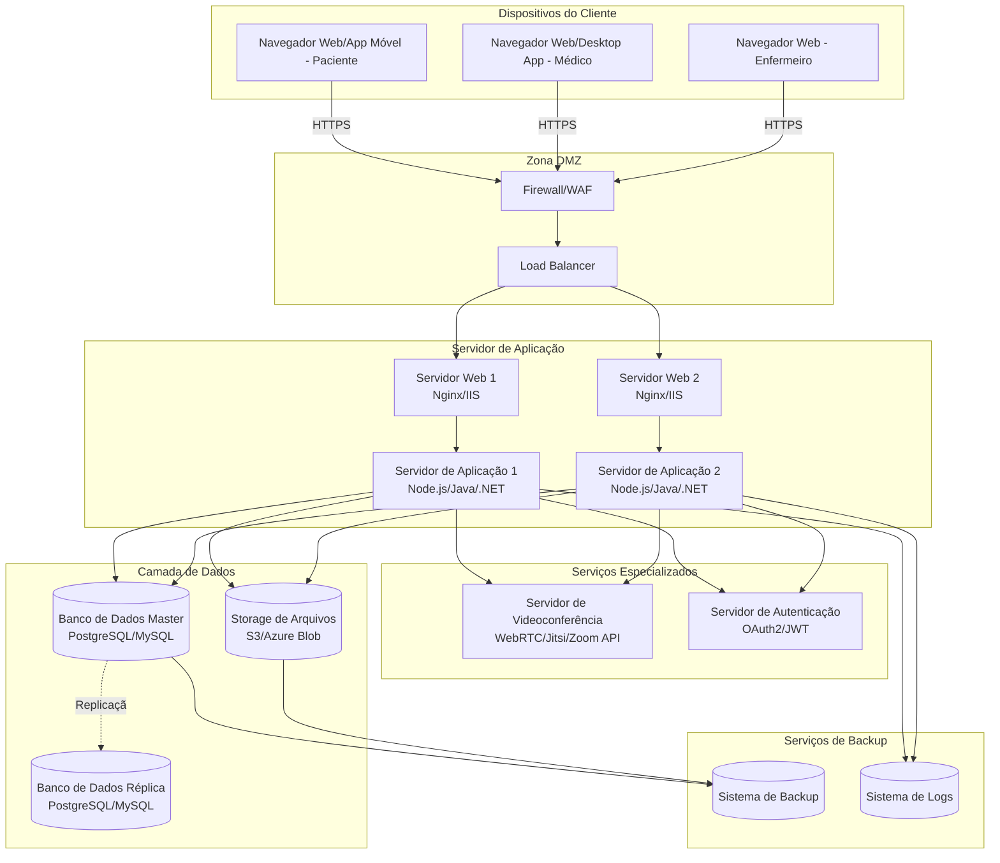

# Sistema de Telemedicina - Diagramas UML

---

## 1. Diagrama de Casos de Uso

---

## 2. Diagrama de Classes

---

## 3. Diagrama de Sequência - Realizar Atendimento de Telemedicina

---

## 4. Diagrama de Sequência - Exceção: Falha de Conexão

---

## 5. Diagrama de Atividades - Fluxo de Atendimento

---

## 6. Diagrama de Estados - Consulta

---

## 7. Diagrama de Componentes

---

## 8. Diagrama de Implantação

---

## 9. Mapeamento de Requisitos para Diagramas

| ID Requisito | Funcionalidade | Diagramas Relacionados |
|--------------|----------------|------------------------|
| RF01 | Realizar Cadastro | Casos de Uso, Classes (Usuario, Paciente) |
| RF02 | Agendar Consulta | Casos de Uso, Classes (Consulta), Componentes |
| RF03 | Participar de Atendimento Online | Casos de Uso, Sequência, Classes (Videoconferencia) |
| RF04 | Realizar Atendimento de Telemedicina | Casos de Uso, Sequência, Atividades, Estados |
| RF05 | Emitir Diagnóstico | Classes (Diagnostico), Sequência |
| RF06 | Emitir Receita Digital | Classes (ReceitaDigital), Sequência, Componentes |
| RF07 | Registrar Informações do Paciente | Classes (Enfermeiro), Sequência |
| RF08 | Auxiliar Atendimento | Casos de Uso, Sequência |
| RF09 | Armazenar Prontuário | Classes (Prontuario), Componentes, Implantação |
| RF10 | Garantir Segurança dos Dados | Componentes (Criptografia), Implantação (Firewall) |

---

## 10. Regras de Negócio nos Diagramas

- **RN01** (Validade da Receita Digital): Implementada na classe `ReceitaDigital` com atributo `dataValidade`
- **RN02** (Tempo Máximo de Atraso): Representada no Diagrama de Atividades e de Estados
- **RN03** (Segurança e Criptografia): Presente no Diagrama de Componentes (Serviço de Criptografia E2EE) e Sequência
- **RN04** (Acesso ao Prontuário): Implementada na classe `Prontuario` com controle de acesso
- **RN05** (Registro Obrigatório): Garantida no fluxo de Sequência e Atividades, salvando automaticamente no prontuário

---

## Ferramentas de Visualização

Estes diagramas foram criados usando **Mermaid**, que pode ser visualizado em:
- GitHub
- Visual Studio Code (com extensões Mermaid)
- Editores online: https://mermaid.live/
- Ferramentas de documentação como GitBook, Notion, etc.

Para converter para outros formatos UML (PlantUML, StarUML, etc.), use ferramentas de conversão ou recrie os diagramas na ferramenta desejada.
